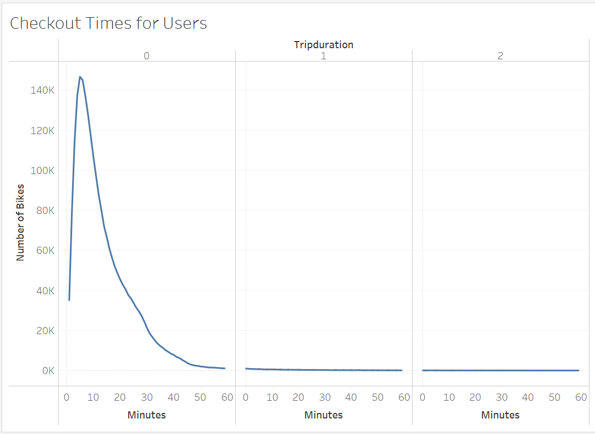
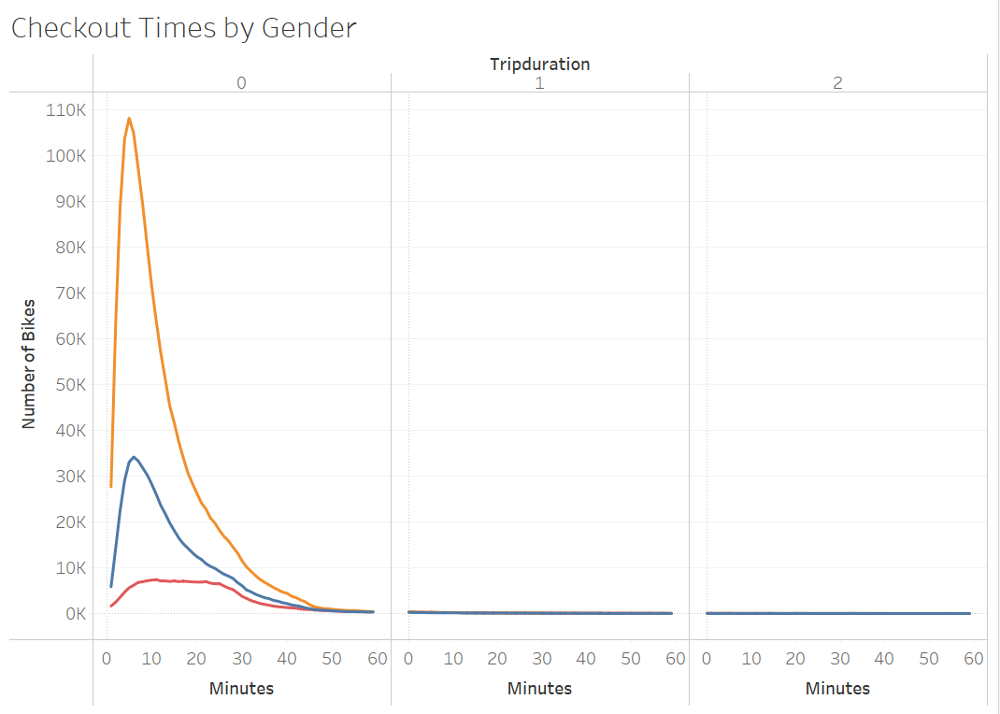
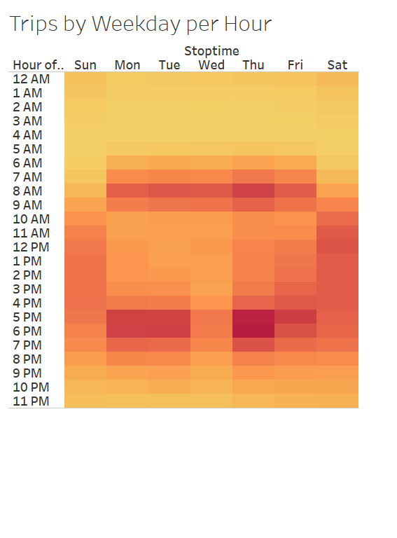
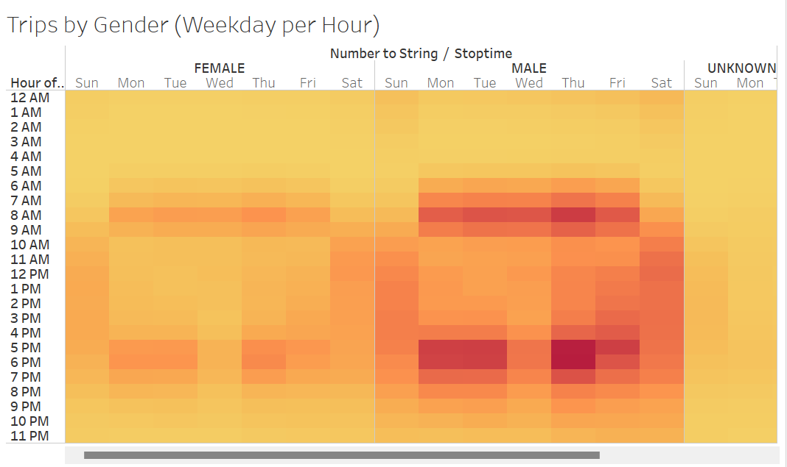
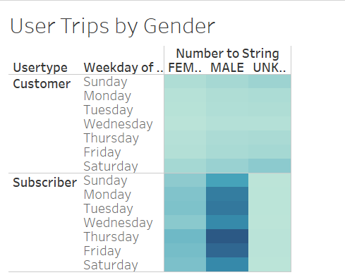

# NYC Citi Bike Sharing
## Overview
The purpose of this analysis was to convince investors that a bike-sharing program in Des Moines is a solid business proposal by creating a set of visualizations to:
- Show the length of time that bikes are checked out for all riders and genders
- Show the number of bike trips for all riders and genders for each hour of each day of the week
- Show the number of bike trips for each type of user and gender for each day of the week.

## Results
The following visualizations from my [Tableau Story](https://public.tableau.com/app/profile/yasmine4678/viz/NYCCitiBike_16607880136500/BikeTripAnalysis?publish=yes) help to soldify the proposal:

## Summary
Overall, the data shows that the bike-sharing industry is a great investment idea. Given the dataset, two addtional visualizations I would perform are:
1. The amount of trips based on the season, to determine what the best time of year would be for bike sharing.
2. How often the bikes are used, to determine how often maintenance is necessary.
